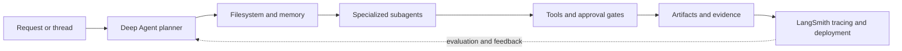

# Architecture

## Intent

The architecture must expose the complete path from user intent to inspected result. It should make durability, tool execution, approval, state, evidence, and observability visible rather than hiding them behind the word “agent.”

## Platform Shape

Linear shorthand: `Request or thread --> Deep Agent planner --> Filesystem and memory --> Specialized subagents --> Tools and approval gates --> Artifacts and evidence --> LangSmith tracing and deployment`

## Decisions to Record

Each implementation must add architecture decision records for:

- Why this platform is appropriate for the scenario
- State and persistence model
- Tool and connector boundaries
- Human approval model
- Data retention and deletion
- Error, retry, and idempotency behavior
- Observability and evaluation integration
- Deployment and tenancy assumptions

## Required Diagrams Before Showcase Release

- System context
- Runtime sequence
- Tool and data trust boundaries
- Failure and recovery path
- Evaluation and feedback loop
