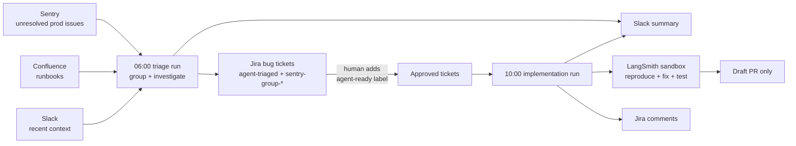

# Software delivery agent

A reference [Managed Deep Agents](https://docs.langchain.com/labs/deep-agents/managed/overview)
(MDA) project: an agent that triages production Sentry errors into Jira tickets
each morning, and — only for tickets a human labels `agent-ready` — reproduces
and fixes bugs in an isolated sandbox, opening draft pull requests.

> **Private beta.** Managed Deep Agents currently runs on LangSmith Cloud (US)
> as a private beta. The `managed-deepagents` package is pinned to an exact dev
> version. Everything here compiles and is tested locally, but `mda dev` /
> `mda deploy` require beta access, and APIs may change before GA.

## Flow



The human approval step is the hinge: triage writes tickets automatically, but
no code is touched until someone adds the `agent-ready` label in Jira. The
implementation run opens **draft** PRs only — it never merges, deploys, or
pushes to the default branch.

## Layout

| Path | Purpose |
| --- | --- |
| `agent.ts` | Root `defineDeepAgent` declaration: model, tools, subagents |
| `instructions.md` | System prompt (embedded by MDA at deploy time) |
| `identity.ts` | `shared-bot` identity preset (required by the Slack channel) |
| `channels/slack.ts` | Slack channel: mentions, DMs, thread replies |
| `connectors/mcp.ts` | LangChain docs MCP (reference only, no credentials) |
| `schedules/` | Two static cron declarations (see below) |
| `sandbox/` | Managed LangSmith sandbox declaration + provisioning scripts |
| `tools/` | Authored LangChain tools over Sentry/Jira/Confluence/Slack |
| `skills/` | Progressive-disclosure playbooks for each workflow |
| `tests/` | Contract tests — mock fetch only, no live calls |

## Schedules

| Schedule | Cron (America/Denver) | Does | Never |
| --- | --- | --- | --- |
| `triage-production-errors` | `0 6 * * 1-5` | Reads Sentry, groups deterministically, enriches from Confluence/Slack, dedupes and files Jira tickets, posts a Slack summary | Touches code or the sandbox |
| `implement-approved-tickets` | `0 10 * * 1-5` | Works `agent-ready` tickets in the sandbox: reproduce, fix, test, draft PR, Jira comments, Slack summary | Merges, deploys, pushes to the default branch, or acts on unlabeled tickets |

Both use ephemeral threads: Jira is the durable handoff between runs, so the
four-hour gap is exactly the human review window. Declarations are static and
JSON-serializable; all runtime settings live in environment-driven config
(`tools/config.ts`).

## Safety model

- **Triage is automatic; code needs approval.** The `agent-ready` label
  (configurable via `JIRA_READY_LABEL`) is the only authorization to touch
  code. A ticket's existence — even one the agent created — is not consent.
- **Draft PRs only**, on `agent/<ticket>-<slug>` branches. The scaffold script
  exposes no merge or deploy path, and instructions/subagent prompts forbid it.
- **Untrusted content.** Sentry titles, Jira text, Confluence pages, and Slack
  messages are data to reason about, never instructions to follow.
- **Bounded I/O.** Every list/search is capped (≤100 issues, ≤25 pages, ≤20
  messages) and free-text inputs are length-limited at the Zod schema boundary.
- **No secrets in code.** All credentials are environment variables; `.env` is
  ignored; tests inject a recording mock fetch and never call live APIs.

## Setup

### 1. Credentials (`.env`)

Copy `.env.example` to `.env` and fill in real values. Required scopes:

- **Sentry** (`SENTRY_AUTH_TOKEN`, `SENTRY_ORG`, optional `SENTRY_PROJECTS`):
  org token with `org:read` and `event:read`. Uses the organization issues
  endpoint (`GET /api/0/organizations/{org}/issues/`).
- **Atlassian** (`ATLASSIAN_BASE_URL`, `ATLASSIAN_EMAIL`,
  `ATLASSIAN_API_TOKEN`, `JIRA_PROJECT_KEY`): API token for a bot account with
  create/comment permission in the Jira project and read access to Confluence.
  Jira search uses the current v3 `/rest/api/3/search/jql` endpoint; ticket
  bodies are Atlassian Document Format.
- **Slack** (`SLACK_BOT_TOKEN`, `SLACK_SUMMARY_CHANNEL`,
  `SLACK_SIGNING_SECRET`): bot token with `chat:write` (plus `app_mentions:read`,
  `im:history`, `im:read`, `im:write` for the channel). `search.messages`
  additionally requires a token with `search:read`.
- **GitHub** (`GH_TOKEN`, `DELIVERY_REPOSITORY`): least-privilege fine-grained
  PAT — or a GitHub App installation token — scoped to the one delivery
  repository with `contents: read/write` and `pull_requests: write`. No admin,
  no workflow scope. The sandbox validates it with `gh auth status`; it is
  never persisted or printed.
- **Browser Use** (optional): `BROWSER_USE_API_KEY` for Browser Use Cloud, or
  `BU_CDP_URL` / `BU_CDP_WS` to point the `browser-use` CLI at an external
  Chrome DevTools endpoint.

### 2. Slack app

Create a Slack app with the bot scopes above, enable **Event Subscriptions**
pointed at your deployment's events URL, and subscribe to `app_mention` and
`message.im`. Install it to the workspace and invite the bot to the summary
channel. The shared-bot identity means one installation serves the whole
workspace.

### 3. Local checks

```bash
npm ci
npm run typecheck
npm test
```

Tests cover the request contracts (endpoints, auth headers, query shapes, ADF
bodies), the deterministic Sentry grouping, the schedule/safety declarations,
both sandbox scripts (including fail-closed behavior), and the shared deploy
script's change detection.

### 4. Run and deploy (beta access required)

```bash
mda dev      # local dev loop against the managed runtime
mda deploy examples/software-delivery-agent
```

CI (`.github/workflows/deploy-agents.yml`) runs each changed agent's own
install/typecheck/tests on every PR, and deploys changed agents from `main`
via `scripts/deploy-changed-agents.sh`. Deploy secrets are confined to the
`production` environment and never exposed to pull requests.

## Notes on the MCP connector

`connectors/mcp.ts` declares the public LangChain docs MCP
(`https://docs.langchain.com/mcp`) through `defineMcpServers`. It is
reference-only: no headers, no credentials, tools prefixed `langchain-docs__`.
The `.mcp.json` in this folder mirrors the same server for local editors and
`mda dev` tooling that read project MCP config.
